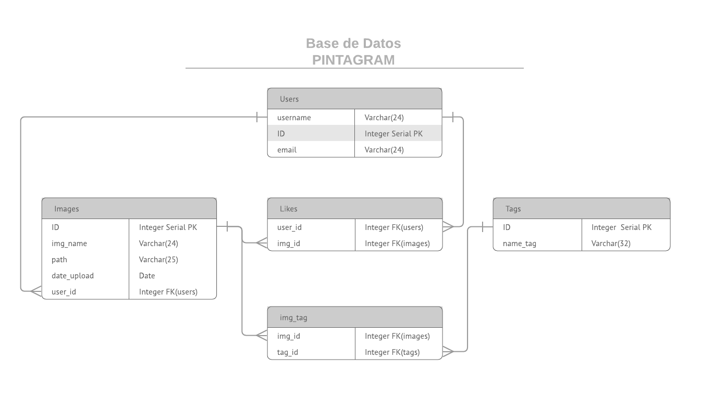

## **Desafío - PostgreSQL Avanzado**

En esta actividad trabajaremos con las diferentes queries desde el terminal de postgres.

Para desarrollar esta actividad, tendrán que anotar cada una de las queries que utilizaron en un archivo txt o md y subir los archivos comprimidos en formato zip a la plataforma Empieza.

Deben también ingresar, al final de este archivo (txt), el nombre de los integrantes del grupo que participaron en el desarrollo de esta actividad. (Cada integrante debe subir el archivo a la plataforma).

**Descripción**
Se busca desarrollar una aplicación llamada Pintagram. Esta aplicación debe permitir a los usuarios subir imágenes y que, a su vez, estas imágenes pertenezcan a ese usuario. Además los usuarios podrán darle like a las imágenes de otros usuarios. Cada una de las imágenes tendrá varios tags y cada uno de esos tags podrá referenciar a varias imágenes. En este ejercicio se tomarán en cuenta las consultas a 2 o más tablas y los constrains al momento de la creación de la tabla.

**Restricciones (constraints)**
En esta parte del ejercicio se debe investigar como aplicar relgas a la base de datos para que se
cumpla:
1. Un usuario solo puede darle like 1 vez a cada imagen.
2. Una imagen no puede tener tags repetidos.

Crear base de datos en base a los requerimientos indicados.

**Checkpoints**
-------------------------
**1.** Antes de empezar a crear la base de datos deben leer todas las instrucciones, modelar la base y generar un diagrama que tendrán que adjuntar a las respuestas de este ejercicio.

 Creacion base de datos "pintagram".

      CREATE DATABASE pintagram;
      \c pintagram;

  Creacion tabla "users".

      CREATE TABLE users(id SERIAL PRIMARY KEY, username VARCHAR(24), email VARCHAR(24));
      \d users
    
                                        Table "public.users"
      Column  |         Type          | Collation | Nullable |              Default
    ----------+-----------------------+-----------+----------+-----------------------------------
     id       | integer               |           | not null | nextval('users_id_seq'::regclass)
     username | character varying(24) |           |          |
     email    | character varying(24) |           |          |
    Indexes:
        "users_pkey" PRIMARY KEY, btree (id)
    Referenced by:
        TABLE "images" CONSTRAINT "images_user_id_fkey" FOREIGN KEY (user_id) REFERENCES users(id)
        TABLE "likes" CONSTRAINT "likes_user_id_fkey" FOREIGN KEY (user_id) REFERENCES users(id)

Creación tabla "images"

        CREATE TABLE images(id SERIAL Primary key,img_name VARCHAR(24),path VARCHAR(25),date_upload DATE,user_id INTEGER);
        \d images
                                          Table "public.images"
       Column    |         Type          | Collation | Nullable |              Default
    -------------+-----------------------+-----------+----------+------------------------------------
     id          | integer               |           | not null | nextval('images_id_seq'::regclass)
     img_name    | character varying(24) |           |          |
     path        | character varying(25) |           |          |
     date_upload | date                  |           |          |
     user_id     | integer               |           |          |
    Indexes:
        "images_pkey" PRIMARY KEY, btree (id)
    Foreign-key constraints:
        "images_user_id_fkey" FOREIGN KEY (user_id) REFERENCES users(id)
    Referenced by:
        TABLE "img_tag" CONSTRAINT "img_tag_img_id_fkey" FOREIGN KEY (img_id) REFERENCES images(id)
        TABLE "likes" CONSTRAINT "likes_img_id_fkey" FOREIGN KEY (img_id) REFERENCES images(id)

    ALTER TABLE images ADD FOREIGN KEY (user_id) REFERENCES users (id);
    
Creación tabla "likes".

        CREATE TABLE likes(user_id INTEGER REFERENCES users (id), img_id INTEGER REFERENCES images (id), PRIMARY KEY(user_id, img_id));
        \d likes
    
                    Table "public.likes"
     Column  |  Type   | Collation | Nullable | Default
    ---------+---------+-----------+----------+---------
     user_id | integer |           | not null |
     img_id  | integer |           | not null |
    Indexes:
        "likes_pkey" PRIMARY KEY, btree (user_id, img_id)
    Foreign-key constraints:
        "likes_img_id_fkey" FOREIGN KEY (img_id) REFERENCES images(id)
        "likes_user_id_fkey" FOREIGN KEY (user_id) REFERENCES users(id)

Creacón tabla "tags".

        CREATE TABLE tags(id SERIAL Primary key, name_tag VARCHAR(32));
        \d tags
                                        Table "public.tags"
      Column  |         Type          | Collation | Nullable |             Default              
    ----------+-----------------------+-----------+----------+----------------------------------
     id       | integer               |           | not null | nextval('tags_id_seq'::regclass)
     name_tag | character varying(32) |           |          | 
    Indexes:
        "tags_pkey" PRIMARY KEY, btree (id)
    Referenced by:
        TABLE "img_tag" CONSTRAINT "img_tag_tag_id_fkey" FOREIGN KEY (tag_id) REFERENCES tags(id)

Creación tabla "img_tag".

   

     CREATE TABLE img_tag(img_id INTEGER REFERENCES images (id), tag_id INTEGER REFERENCES tags (id), PRIMARY KEY(img_id, tag_id));
      \d img_tag 
    
                  Table "public.img_tag"
     Column |  Type   | Collation | Nullable | Default 
    --------+---------+-----------+----------+---------
     img_id | integer |           | not null | 
     tag_id | integer |           | not null | 
    Indexes:
        "img_tag_pkey" PRIMARY KEY, btree (img_id, tag_id)
    Foreign-key constraints:
        "img_tag_img_id_fkey" FOREIGN KEY (img_id) REFERENCES images(id)
        "img_tag_tag_id_fkey" FOREIGN KEY (tag_id) REFERENCES tags(id)

**2.** Ingresar 2 imágenes por usuario.

  

      INSERT INTO users (username, email) VALUES ('Mauricio', 'mauro@dl.com');
      INSERT INTO users (username, email) VALUES ('Maria Isabel', 'xave@dl.com');
      INSERT INTO users (username, email) VALUES ('Paula', 'pau@dl.com');
      SELECT * FROM  users;
    
       id |   username   |    email
      ----+--------------+--------------
        1 | Mauricio     | mauro@dl.com
        2 | Maria Isabel | xave@dl.com
        3 | Paula        | pau@dl.com
    
      INSERT INTO images (img_name, path, date_upload, user_id) VALUES ('mauro imagen 1', '/home/img1.jpg', now(), 1);
      INSERT INTO images (img_name, path, date_upload, user_id) VALUES ('mauro imagen 2', '/home/img1.jpg', now(), 1);
      INSERT INTO images (img_name, path, date_upload, user_id) VALUES ('xave imagen 2', '/home/img2.jpg', now(), 2);
      INSERT INTO images (img_name, path, date_upload, user_id) VALUES ('xave imagen 1', '/home/img2.jpg', now(), 2);
      INSERT INTO images (img_name, path, date_upload, user_id) VALUES ('pau imagen 3', '/home/img3.jpg', now(), 3);
      INSERT INTO images (img_name, path, date_upload, user_id) VALUES ('pau imagen 4', '/home/img3.jpg', now(), 3);
      SELECT * FROM images;
    
       id |    img_name    |      path      | date_upload | user_id
      ----+----------------+----------------+-------------+---------
        1 | mauro imagen 1 | /home/img1.jpg | 2019-08-03  |       1
        2 | xave imagen 2  | /home/img2.jpg | 2019-08-03  |       2
        3 | pau imagen 3   | /home/img3.jpg | 2019-08-03  |       3
        4 | mauro imagen 2 | /home/img1.jpg | 2019-08-03  |       1
        5 | xave imagen 1  | /home/img2.jpg | 2019-08-03  |       2
        6 | pau imagen 4   | /home/img3.jpg | 2019-08-03  |       3
      (6 rows)

**3.** Ingresar 3 likes por cada imagen.

      INSERT INTO likes (user_id, img_id) VALUES (1, 1);
      INSERT INTO likes (user_id, img_id) VALUES (1, 2);
      INSERT INTO likes (user_id, img_id) VALUES (1, 3);
      INSERT INTO likes (user_id, img_id) VALUES (1, 4);
      INSERT INTO likes (user_id, img_id) VALUES (1, 5);
      INSERT INTO likes (user_id, img_id) VALUES (1, 6);
      INSERT INTO likes (user_id, img_id) VALUES (2, 1);
      INSERT INTO likes (user_id, img_id) VALUES (2, 2);
      INSERT INTO likes (user_id, img_id) VALUES (2, 3);
      INSERT INTO likes (user_id, img_id) VALUES (2, 4);
      INSERT INTO likes (user_id, img_id) VALUES (2, 5);
      INSERT INTO likes (user_id, img_id) VALUES (2, 6);
      INSERT INTO likes (user_id, img_id) VALUES (3, 1);
      INSERT INTO likes (user_id, img_id) VALUES (3, 2);
      INSERT INTO likes (user_id, img_id) VALUES (3, 3);
      INSERT INTO likes (user_id, img_id) VALUES (3, 4);
      INSERT INTO likes (user_id, img_id) VALUES (3, 5);
      INSERT INTO likes (user_id, img_id) VALUES (3, 6);
      SELECT img_id, user_id FROM likes ORDER BY img_id, user_id;
    
       img_id | user_id
      --------+---------
            1 |       1
            1 |       2
            1 |       3
            2 |       1
            2 |       2
            2 |       3
            3 |       1
            3 |       2
            3 |       3
            4 |       1
            4 |       2
            4 |       3
            5 |       1
            5 |       2
            5 |       3
            6 |       1
            6 |       2
            6 |       3

**4.** Ingresar 8 tags.

  

    INSERT INTO tags (name_tag) VALUES ('tag_1');
      INSERT INTO tags (name_tag) VALUES ('tag_2');
      INSERT INTO tags (name_tag) VALUES ('tag_3');
      INSERT INTO tags (name_tag) VALUES ('tag_4');
      INSERT INTO tags (name_tag) VALUES ('tag_5');
      INSERT INTO tags (name_tag) VALUES ('tag_6');
      INSERT INTO tags (name_tag) VALUES ('tag_7');
      INSERT INTO tags (name_tag) VALUES ('tag_8');
      SELECT * FROM tags;
    
       id | name_tag
      ----+----------
        1 | tag_1
        2 | tag_2
        3 | tag_3
        4 | tag_4
        5 | tag_5
        6 | tag_6
        7 | tag_7
        8 | tag_8

**5.** Ingresar 3 tags por imagen.

 

     INSERT INTO img_tag (img_id, tag_id) VALUES (1, 1);
      INSERT INTO img_tag (img_id, tag_id) VALUES (1, 2);
      INSERT INTO img_tag (img_id, tag_id) VALUES (1, 3);
      INSERT INTO img_tag (img_id, tag_id) VALUES (2, 4);
      INSERT INTO img_tag (img_id, tag_id) VALUES (2, 5);
      INSERT INTO img_tag (img_id, tag_id) VALUES (2, 6);
      INSERT INTO img_tag (img_id, tag_id) VALUES (3, 7);
      INSERT INTO img_tag (img_id, tag_id) VALUES (3, 8);
      INSERT INTO img_tag (img_id, tag_id) VALUES (3, 1);
      INSERT INTO img_tag (img_id, tag_id) VALUES (4, 2);
      INSERT INTO img_tag (img_id, tag_id) VALUES (4, 3);
      INSERT INTO img_tag (img_id, tag_id) VALUES (4, 4);
      INSERT INTO img_tag (img_id, tag_id) VALUES (5, 5);
      INSERT INTO img_tag (img_id, tag_id) VALUES (5, 6);
      INSERT INTO img_tag (img_id, tag_id) VALUES (5, 7);
      INSERT INTO img_tag (img_id, tag_id) VALUES (6, 8);
      INSERT INTO img_tag (img_id, tag_id) VALUES (6, 1);
      INSERT INTO img_tag (img_id, tag_id) VALUES (6, 2);
      SELECT * FROM img_tag;
    
       img_id | tag_id
      --------+--------
            1 |      1
            1 |      2
            1 |      3
            2 |      4
            2 |      5
            2 |      6
            3 |      7
            3 |      8
            3 |      1
            4 |      2
            4 |      3
            4 |      4
            5 |      5
            5 |      6
            5 |      7
            6 |      8
            6 |      1
            6 |      2

**6.** Crear una consulta que muestre el nombre de la imagen y la cantidad de likes que tiene esa imagen.

     SELECT images.img_name, count(likes.img_id) AS likes FROM images FULL JOIN likes ON images.id = likes.img_id group by img_name;
    
         img_name    | likes
      ----------------+-------
      xave imagen 1  |     3
      xave imagen 2  |     3
      mauro imagen 1 |     3
      mauro imagen 2 |     3
      pau imagen 3   |     3
      pau imagen 4   |     3

**7.** Crear una consulta que muestre el nombre del usuario y los nombres de las fotos que le pertenecen.

     SELECT users.username, images.img_name FROM users, images where users.id = images.user_id order by username;
    
       username   |    img_name    
    --------------+----------------
     Maria Isabel | xave imagen 2
     Maria Isabel | xave imagen 1
     Mauricio     | mauro imagen 1
     Mauricio     | mauro imagen 2
     Paula        | pau imagen 3
     Paula        | pau imagen 4
    (6 rows)

**8.** Crear una consulta que muestre el nombre del tag y la cantidad de imagenes asociadas a ese tag.

    SELECT tags.name_tag, count(img_tag.img_id) AS N°images FROM tags, img_tag where tags.id = img_tag.tag_id group by tags.name_tag order by tags.name_tag asc;
    
     name_tag | n°images 
    ----------+----------
     tag_1    |        3
     tag_2    |        3
     tag_3    |        2
     tag_4    |        2
     tag_5    |        2
     tag_6    |        2
     tag_7    |        2
     tag_8    |        2

